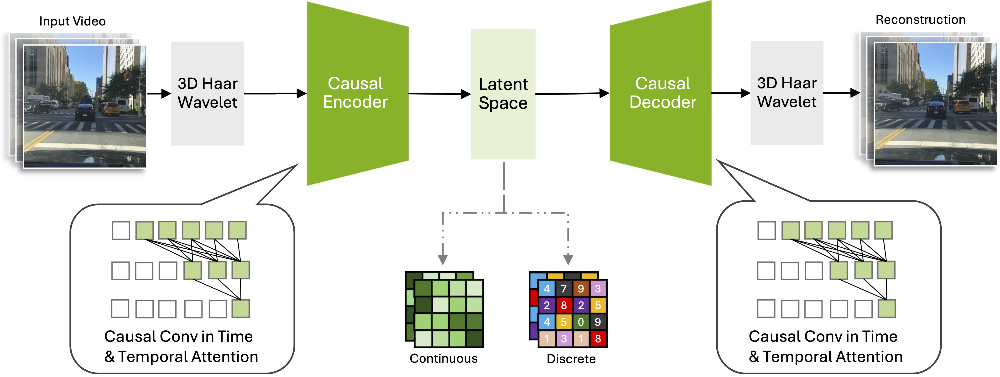
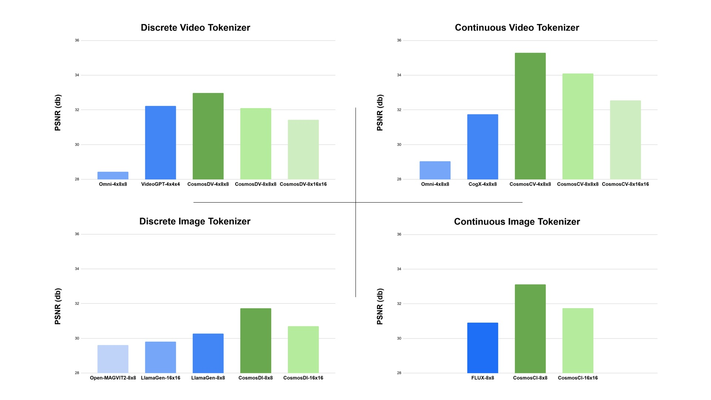
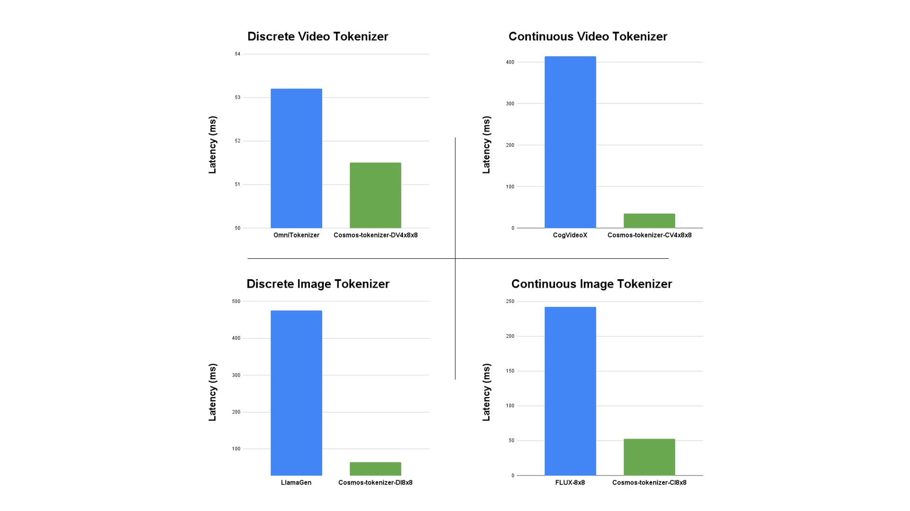

<!-- # SPDX-FileCopyrightText: Copyright (c) 2024 NVIDIA CORPORATION & AFFILIATES. All rights reserved.
# SPDX-License-Identifier: Apache-2.0
#
# Licensed under the Apache License, Version 2.0 (the "License");
# you may not use this file except in compliance with the License.
# You may obtain a copy of the License at
#
# http://www.apache.org/licenses/LICENSE-2.0
#
# Unless required by applicable law or agreed to in writing, software
# distributed under the License is distributed on an "AS IS" BASIS,
# WITHOUT WARRANTIES OR CONDITIONS OF ANY KIND, either express or implied.
# See the License for the specific language governing permissions and
# limitations under the License. -->
# Cosmos Tokenizer: A suite of image and video neural tokenizers.

### [Website](https://research.nvidia.com/labs/dir/cosmos-tokenizer) | [NVIDIA News](https://blogs.nvidia.com/blog/robot-learning-humanoid-development/) | [NVIDIA Blog](https://developer.nvidia.com/blog/state-of-the-art-multimodal-generative-ai-model-development-with-nvidia-nemo/)  | [Hugging Face](https://huggingface.co/collections/nvidia/cosmos-tokenizer-672b93023add81b66a8ff8e6) | [YouTube](https://youtu.be/Soy_myOfWIU) | [TokenBench](https://github.com/NVlabs/TokenBench)

We present **Cosmos Tokenizer**, a suite of image and video tokenizers that advances the state-of-the-art in visual tokenization, paving the way for scalable, robust and efficient development of large auto-regressive transformers (such as LLMs) or diffusion generators. This repo hosts the inference codes and shares pre-trained models for the different tokenizers. Please check out our [demo video](https://youtu.be/Soy_myOfWIU).


|                   | Continuous ( C )    | Discrete ( D )      |
| ------------------|---------------------|---------------------|
| **Images ( I )**        | Cosmos-Tokenizer-CI      | Cosmos-Tokenizer-DI      |
| **Videos ( V )**        | Cosmos-Tokenizer-CV      | Cosmos-Tokenizer-DV      |

[](https://github.com/user-attachments/assets/996a8896-d1b0-4e56-a117-771df6a1d379)


Given an image or video, Cosmos Tokenizer outputs either continuous latents or discrete tokens. Cosmos Tokenizer achieves spatial compression rates of 8x or 16x and temporal compression factors of 4x or 8x, resulting in a total compression factor of up to 2048x (=8x16x16).
Cosmos Tokenizer delivers 8x more total compression than state-of-the-art (SOTA) methods, while simultaneously maintaining higher image quality and running up to 12x faster than the best available SOTA tokenizers.



## Licenses
- **Models**: The models are licensed under [NVIDIA Open Model License](https://developer.download.nvidia.com/licenses/nvidia-open-model-license-agreement-june-2024.pdf). Under the NVIDIA Open Model License, NVIDIA confirms:
  - Models are commercially usable. 
  - You are free to create and distribute Derivative Models. 
  - NVIDIA does not claim ownership to any outputs generated using the Models or Derivative Models.
- **GitHub Code**: This repository is licensed under the [Apache 2.0
  license](https://github.com/NVIDIA/Cosmos-Tokenizer/blob/main/LICENSE).

## Installation
- Clone the source code
```
git clone https://github.com/NVIDIA/Cosmos-Tokenizer.git
cd Cosmos-Tokenizer
```
- Install via pip
```
apt-get install -y ffmpeg
pip3 install -e .
```

Preferably, build a docker image using the provided Dockerfile
```
docker build -t cosmos-docker -f Dockerfile .

# You can run the container as:
docker run --gpus all -it --rm -v /home/${USER}:/home/${USER} \
    --workdir ${PWD} cosmos-docker /bin/bash
```

## Download Pre-trained Checkpoints from Hugging Face


We host 10 Cosmos-Tokenizer models on [Hugging Face](https://huggingface.co/collections/nvidia/cosmos-tokenizer-672b93023add81b66a8ff8e6), with the following model names. You can use this snippet to download:
```python
from huggingface_hub import login, snapshot_download
import os

login(token="<YOUR-HF-TOKEN>", add_to_git_credential=True)
model_names = [
        "Cosmos-Tokenizer-CI8x8",
        "Cosmos-Tokenizer-CI16x16",
        "Cosmos-Tokenizer-CV4x8x8",
        "Cosmos-Tokenizer-CV8x8x8",
        "Cosmos-Tokenizer-CV8x16x16",
        "Cosmos-Tokenizer-DI8x8",
        "Cosmos-Tokenizer-DI16x16",
        "Cosmos-Tokenizer-DV4x8x8",
        "Cosmos-Tokenizer-DV8x8x8",
        "Cosmos-Tokenizer-DV8x16x16",
]
for model_name in model_names:
    hf_repo = "nvidia/" + model_name
    local_dir = "pretrained_ckpts/" + model_name
    os.makedirs(local_dir, exist_ok=True)
    print(f"downloading {model_name}...")
    snapshot_download(repo_id=hf_repo, local_dir=local_dir)
```
Under the checkpoint repository `pretrained_ckpts/{model_name}`, we provide the encoder, decoder and the full autoencoder JIT models.
```bash 
├── Cosmos-Tokenizer-DV4x8x8/
│   ├── encoder.jit
│   ├── decoder.jit
│   ├── autoencoder.jit
```
## Running the codes
You can use the following example commands to encode and decode images or videos. <br />
For each, the same command works for both continuous and discrete tokenization. Simply provide the proper JIT-compiled ckpt to `checkpoint_enc`, `checkpoint_dec`, or the full autoencoder ckpt to `checkpoint`.

### Encoding into Continuous Latent Space

```python
import torch
from cosmos_tokenizer.video_lib import CausalVideoTokenizer

model_name = "Cosmos-Tokenizer-CV4x8x8"
input_tensor = torch.randn(1, 3, 9, 512, 512).to('cuda').to(torch.bfloat16)  # [B, C, T, H, W]
encoder = CausalVideoTokenizer(checkpoint_enc=f'pretrained_ckpts/{model_name}/encoder.jit')
(latent,) = encoder.encode(input_tensor)
torch.testing.assert_close(latent.shape, (1, 16, 3, 64, 64))

# The input tensor can be reconstructed by the decoder as:
decoder = CausalVideoTokenizer(checkpoint_dec=f'pretrained_ckpts/{model_name}/decoder.jit')
reconstructed_tensor = decoder.decode(latent)
torch.testing.assert_close(reconstructed_tensor.shape, input_tensor.shape)
```
The `latent` will have the shape `(1, 16, 3, 64, 64)`, where the first of the three latents represents the first frame, and C=16 is the number of channels of the latent.

### Encoding into Discrete Tokens
```python
import torch
from cosmos_tokenizer.video_lib import CausalVideoTokenizer

model_name = "Cosmos-Tokenizer-DV4x8x8"
input_tensor = torch.randn(1, 3, 9, 512, 512).to('cuda').to(torch.bfloat16)  # [B, C, T, H, W]
encoder = CausalVideoTokenizer(checkpoint_enc=f'pretrained_ckpts/{model_name}/encoder.jit')
(indices, codes) = encoder.encode(input_tensor)
torch.testing.assert_close(indices.shape, (1, 3, 64, 64))
torch.testing.assert_close(codes.shape, (1, 6, 3, 64, 64))

# The input tensor can be reconstructed by the decoder as:
decoder = CausalVideoTokenizer(checkpoint_dec=f'pretrained_ckpts/{model_name}/decoder.jit')
reconstructed_tensor = decoder.decode(indices)
torch.testing.assert_close(reconstructed_tensor.shape, input_tensor.shape)
```
The `indices` will have the shape `(1, 3, 64, 64)` and contain integral values in the range `[1..64K]`, where the first of the three integral maps represents the first frame. 
The `codes` will contain the pre-quantization continuous latent with shape `(1, 6, 3, 64, 64)`, where C=6 represents the number of FSQ levels.

## Torchscript (PyTorch JIT) Inference APIs
The following instructions run the various tokenizer on the example image and video provided in `test_data/`.

- Autoencoding images. Accepts an input image, and outputs a reconstruction of the image obtained by decoding the encoded latents. 
```bash
# Autoencoding images using `Cosmos-CI` with a compression rate of 8x8.
model_name="Cosmos-Tokenizer-CI8x8"
python3 -m cosmos_tokenizer.image_cli \
    --image_pattern 'test_data/image.png' \
    --checkpoint_enc pretrained_ckpts/${model_name}/encoder.jit \
    --checkpoint_dec pretrained_ckpts/${model_name}/decoder.jit
```
If `--output_dir` is not specified, you can find the reconstructed image at `test_data/reconstructions/image.png`.

- Autoencoding videos. Accepts an input video, and outputs a reconstruction of the video obtained by decoding the encoded latents.
```bash
# Autoencoding videos using `Cosmos-DV` with a compression rate of 4x8x8.
model_name="Cosmos-Tokenizer-DV4x8x8"
python3 -m cosmos_tokenizer.video_cli \
    --video_pattern 'test_data/video.mp4' \
    --checkpoint_enc pretrained_ckpts/${model_name}/encoder.jit \
    --checkpoint_dec pretrained_ckpts/${model_name}/decoder.jit
```
If `--output_dir` is not specified, then you can find the reconstructed video at `test_data/reconstructions/video.mp4`.

## PyTorch Inference APIs

To run the tokenizers in native PyTorch, append your commands with `--mode=torch`.  <br />
In PyTorch mode, the model is constructed from the native network definition scripts, which requires providing additional arguments to configure the model for instantiation. 

For example, to instantiate a `Cosmos-DI` with a spatial compression factor of 8, append the following command line arguments:

- `--mode=torch`
- `--tokenizer_type=DI`
- `--spatial_compression=8`

Note that the `--checkpoint_enc`, `--checkpoint_dec`, and `--checkpoint` should still refer to JIT files. <br />
The necessary `state_dict`s will be extracted from the loaded JIT models to initialize the weights of the constructed native PyTorch model.

```bash
# Autoencoding images using `Cosmos-DI` with a compression rate of 8x8.
model_name="Cosmos-Tokenizer-DI8x8"
python3 -m cosmos_tokenizer.image_cli \
    --image_pattern 'test_data/*.png' \
    --mode=torch \
    --tokenizer_type=DI \
    --spatial_compression=8 \
    --checkpoint_enc pretrained_ckpts/${model_name}/encoder.jit \
    --checkpoint_dec pretrained_ckpts/${model_name}/decoder.jit
```

To instantiate a `Cosmos-CV` with a temporal factor of 8 and a spatial compression factor of 8, append the following command line arguments:

- `--mode=torch`
- `--tokenizer_type=CV`
- `--temporal_compression=8`
- `--spatial_compression=8`

```bash
# Autoencoding videos using `Cosmos-CV` with a compression rate of 8x8x8.
model_name="Cosmos-Tokenizer-CV8x8x8"
python3 -m cosmos_tokenizer.video_cli \
    --video_pattern 'test_data/*.mp4' \
    --mode=torch \
    --tokenizer_type=CV \
    --temporal_compression=8 \
    --spatial_compression=8 \
    --checkpoint_enc pretrained_ckpts/${model_name}/encoder.jit \
    --checkpoint_dec pretrained_ckpts/${model_name}/decoder.jit
```

## Inference & dataset tokenization with NeMo (JIT/TensorRT)
TensorRT inference is coming soon, which will be available in [Cosmos Tokenizer README within the NeMo repository](https://github.com/NVIDIA/NeMo/tree/main/nemo/collections/common/video_tokenizers)

### JIT inference
Please install NeMo from the GitHub `main` branch following the instructions [here](https://github.com/NVIDIA/NeMo?tab=readme-ov-file#pip-from-a-source-branch).

Run the following code to tokenize the video:

```python
import torch
from nemo.collections.common.video_tokenizers.cosmos_vision_tokenizer import CausalVideoTokenizer
model_name = "Cosmos-Tokenizer-CV4x8x8"
model = CausalVideoTokenizer.from_pretrained(model_name)
input_tensor = torch.randn(1, 3, 9, 512, 512).to('cuda').to(torch.bfloat16)
(latent, ) = model.encode(input_tensor)
```

### dataset tokenization and multimodal model training
Please see the [Cosmos Tokenizer README within the NeMo repository](https://github.com/NVIDIA/NeMo/tree/main/nemo/collections/common/video_tokenizers) for additional examples to create multimodal training datasets with the Cosmos Tokenizer.


## Evaluation
Quantitative comparision of our tokenizer and previous tokenizers on DAVIS (Perazzi et al., 2016) dataset. Cosmos Tokenizer achieves state-of-the-art results. Even at higer compression rates (8x8x8 and 8x16x16), Cosmos Tokenizer outperforms previous methods, demonstrating excellent compression-quality trade-off.

## Performance
Comparision of parameter counts and average encoding and decoding times per image or per video frame on a single A100 80GB GPU. Cosmos Tokenizer achieves 2x to 12x faster speeds than previous methods while maintaining smallest model sizes, demonstrating high tokenization efficiency. 



## [TokenBench](https://github.com/NVlabs/TokenBench)
TokenBench is a comprehensive benchmark that we have curated to standardize the evaluation of [Cosmos-Tokenizer](https://github.com/NVIDIA/Cosmos-Tokenizer). It covers a wide variety of domains including robotic manipulation, driving, egocentric, and web videos. It consists of high-resolution, long-duration videos, and is designed to benchmark video tokenizers. We have made TokenBench publicly available at [github.com/NVlabs/TokenBench](https://github.com/NVlabs/TokenBench).

## Core Contributors

Fitsum Reda, Jinwei Gu, Xian Liu, Songwei Ge, Ting-Chun Wang, Haoxiang Wang, Ming-Yu Liu


## Acknowledgments
We would like to acknowledge the following projects where parts of the codes in the [cosmos_tokenizer/modules](cosmos_tokenizer/modules) folder is derived from:
- [CompVis/stable-diffusion](https://github.com/CompVis/stable-diffusion)
- [lucidrains/magvit2-pytorch](https://github.com/lucidrains/magvit2-pytorch)
- [lucidrains/vector-quantize-pytorch](https://github.com/lucidrains/vector-quantize-pytorch)
- [CompVis/taming-transformers](https://github.com/CompVis/taming-transformers)
